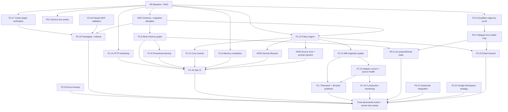

# Arcwell TODO Execution DAG

Last updated: 2026-06-20

This DAG turns `TODO.md` into implementable work. It is intentionally explicit
about dependencies, write ownership, validation, and adversarial review gates.
Do not mark a node done until implementation, tests, severe review, docs,
`STATUS.md`, and `TODO.md` all agree.

## Execution Status

Implementation pass on 2026-06-20 completed the local/testable work for every
node in waves 1-4. The DAG is not fully product-live because several nodes have
external proof blockers:

- P0.3: authenticated deployed Cloudflare ingress/drain now passes with
  synthetic staging events.
- P0.4: live Telegram bot/webhook still needs a disposable chat message during
  the smoke window.
- P1.6/P1.7/P1.16: memory, research/librarian, and X monitoring have local
  severe coverage; live model/provider quality, X API tier/scopes, and delivery
  proof remain.
- P2.18/P2.19: Claude MCP and packaging have local smokes; authenticated Claude
  host UI proof, Homebrew/GitHub artifacts, and Linux systemd remain.
- P2.21: Garderobe is vendored as a package boundary with dry-run checks, but
  live OAuth/MCP deployment, placeholder D1/KV ids, and source-project license
  provenance remain.
- P2.22/P2.23: Google Workspace strategy and email package boundary are done;
  no Arcwell Google API package or live Email Routing worker is claimed.

Final local integration gate passed: `cargo fmt -- --check`,
`cargo test --all --all-features`, Cloudflare worker typecheck/tests,
Codex plugin/docs verifier+self-test, `scripts/arcwell-dev smoke/sync`,
email tests, Garderobe typecheck/test/Wrangler dry-run, release-readiness smoke,
Claude MCP smoke, memory eval corpus, service no-live smoke, and local portions
of X/Telegram live-smoke scripts.

## Global Gates

Every implementation node must pass:

- Root-cause analysis for any failing command or test.
- At least one severe/adversarial test that refutes the node's main behavioral
  claim.
- `cargo fmt -- --check` for Rust changes.
- `cargo test --all --all-features` for meaningful Rust changes.
- `cd packages/arcwell-edge-inbox/worker && npm run typecheck && npm test` for
  Cloudflare worker changes.
- `scripts/arcwell-dev smoke` and `scripts/arcwell-dev sync` for Codex plugin,
  skill, hook, slash-command, or MCP schema changes.
- Documentation updates in `STATUS.md`, `TODO.md`, package README files, and
  relevant docs.

External live-smoke nodes may remain blocked when secrets, deployed services, or
authenticated host applications are unavailable, but the blocker must be exact.

## Node Legend

- `R`: root/foundation
- `P0`: trust blocker
- `P1`: core product
- `P2`: portability/future
- `XR`: cross-cutting reliability
- `Review`: adversarial review or severe testing

## DAG

## Wave Plan

### Wave 0: Coordination And Baseline

| Node | Owner | Scope | Done condition |
| --- | --- | --- | --- |
| R0 | Main agent | Create this DAG, confirm current state, launch wave 1 subagents. | DAG exists and wave 1 owners have disjoint scopes. |

### Wave 1: Independent Foundations

| Node | Owner | Primary write scope | Severe gate |
| --- | --- | --- | --- |
| P1.13 HTTP hardening | `subagent-http-ops` | `crates/arcwell-cli/src/main.rs`, CLI HTTP tests, ops docs only if needed | Missing auth, hostile Origin, huge query, HTML/script in errors, locked/missing DB, secret-like error redaction. |
| P1.12 Policy engine | `subagent-policy` | Policy structs/store methods/tests in `crates/arcwell-core/src/lib.rs`; CLI/MCP policy admin once core is stable | Denied or approval-gated provider paths must not read credentials or mutate state; CLI/MCP secret admin must policy-deny before mutation; malformed policy fails closed. |
| P1.8 Work-memory graph | `subagent-work-graph` | Work-run schema/core methods/tests in `crates/arcwell-core/src/lib.rs`; avoid policy/HTTP edits | Secret redaction, prompt injection in logs, generated-summary citation loop, missing validation as success. |
| P1.14/P1.15 Source quality | `subagent-source-quality` | Wiki ingest/adapters/source health in `crates/arcwell-core/src/lib.rs`; package README/docs | SSRF redirects, huge/binary HTML, duplicate canonical URL, cursor partial-write, retry storms. |
| P2.17/P2.20 Plugin/docs verification | `subagent-plugin-docs` | scripts, plugin prompt audits, docs/status wording; no Rust core edits unless strictly needed | Missing MCP tool, stale slash command, unsafe command prompt, docs overclaim. |

### Wave 2: Dependent Core

| Node | Depends on | Owner | Severe gate |
| --- | --- | --- | --- |
| P1.9 Procedural learning | P1.8, P1.12 | `subagent-procedures` | Prompt injection in traces cannot auto-create procedure; path traversal in generated procedure file rejected. |
| P1.11 Cost controls completion | P1.12 | `subagent-policy-cost` | Runaway queue and concurrent budget decisions cannot overspend. |
| XR25 Secrets lifecycle | P1.12 | `subagent-secrets` | Secrets never leak through logs, errors, MCP resources, backups, ops, or command echo. |
| XR26 Source trust policy | P1.12, P1.14 | `subagent-source-trust` | Untrusted source/channel text is never elevated into instructions. |

### Wave 3: UX, Integrations, And Live Proof

| Node | Depends on | Owner | Severe gate |
| --- | --- | --- | --- |
| P1.10 Ops UI | P1.8, P1.9, P1.11, P1.12, P1.13, XR25, XR26 | `subagent-ops-ui` | XSS, CSRF-like POST, double-click controls, unauthorized mutation, keyboard-only critical flows. |
| P0.3 Edge live proof | P1.12 where policy touches network | `subagent-edge-live` | Deployed D1 event survives offline period and acks only after local persistence. |
| P0.4 Telegram live loop | P0.3 | `subagent-telegram-live` | Unauthorized chat cannot read/write/send; real webhook drains once; 429 retries safely. |
| P0.5 Live project/thread state | P1.8, P0.4 | `subagent-project-state` | Stale/manual state never masquerades as live state. |
| P0.2 Service live smoke | R0 | `subagent-service-live` | launchd restart/recovery and strict doctor detect stopped/stale workers. |

### Wave 4: Product Completeness

| Node | Depends on | Owner | Severe gate |
| --- | --- | --- | --- |
| P1.6 Memory completion | P1.12, P1.10 | `subagent-memory` | False-positive evals, sensitive capture review, backup tombstone policy, live host hooks. |
| P1.7 Research/librarian synthesis | P1.14, P1.15, XR26 | `subagent-research` | Fake citations, generated-page recursion, contradiction smoothing, stale source. |
| P1.16 X production monitoring | P1.11, P1.15, XR25 | `subagent-x` | Polluted following list, quota failure, unsafe links, cursor corruption. |
| P2.18 Claude MCP validation | P2.17 | `subagent-claude` | Unsupported MCP methods and huge responses fail safely. |
| P2.19 Packaging/release | P2.17, P2.18, XR24 | `subagent-packaging` | Interrupted upgrade, stale binary plugin, duplicate service install. |
| P2.21 Garderobe | P1.12, XR25, XR26 | `subagent-garderobe` | Auth bypass and private inventory leakage. |
| P2.22 Google strategy | P1.12, XR26 | `subagent-google` | Overbroad scopes and private email/doc leakage. |
| P2.23 Email channel | P0.4, P1.12, P1.15, XR26 | `subagent-email` | Spoofed sender, malicious HTML, attachment bombs, duplicate Message-ID. |

## Subagent Contract

Every subagent must:

1. State assumptions, behavioral claim, and success criteria before coding.
2. Work only in its assigned scope unless it first reports a dependency issue.
3. Avoid reverting unrelated user or peer changes.
4. Add severe/adversarial tests using the `severe-testing` skill.
5. Run the strongest relevant validation it can run locally.
6. Update `TODO.md`, `STATUS.md`, and relevant docs only for its completed
   scope.
7. End with changed files, validation commands/results, findings fixed, and
   remaining blocked risk.

## Integration Rules

- Main agent integrates one subagent at a time.
- If two subagents touch `crates/arcwell-core/src/lib.rs`, integrate the smaller
  foundational patch first, rerun tests, then rebase/adapt the second manually.
- Live-smoke nodes must never use production data or unbounded third-party
  traffic. Use disposable chats, staging workers, temporary homes, and test
  secrets.
- Any failed severe test must be root-caused before adding additional fixes.
