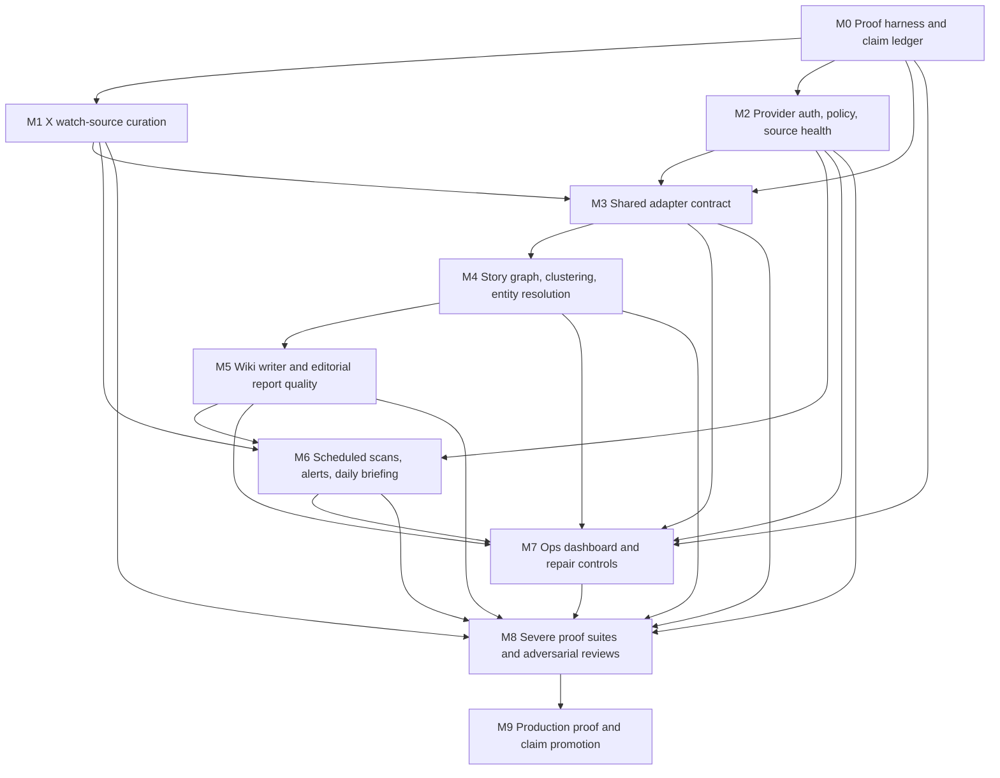

# Autonomous Knowledge System Completion Plan

Date: 2026-06-29

Related artifacts:

- `docs/x-watch-curation-and-knowledge-pipeline-hardening-plan.md`
- `docs/reports/2026-06-29-x-watch-curation-preview.csv`
- `docs/reports/2026-06-29-x-watch-curation-preview-safe.csv`
- `docs/reports/2026-06-29-source-ingestion-inventory.csv`
- `docs/reports/2026-06-29-source-downstream-proof.csv`
- `.arcwell-dev/audits/source-ingestion-20260629T101507Z-12236/artifacts/proof-packet.json`

Source-of-truth rule: this document is the executable completion plan. The
other linked docs are supporting audit/history/detail. If another doc disagrees
with this one, update the other doc or treat it as stale before implementing.

## User-Visible Claim

Arcwell maintains a curated, high-signal source graph across X/Twitter, GitHub, RSS/blogs, company pages, research feeds, Reddit/web captures, and other configured sources; fetches those sources on a robust schedule; writes and updates source-backed wiki pages; detects new and developing stories; reasons over what has changed against prior wiki knowledge; and sends useful human-readable briefings and urgent alerts without exposing internal ledger language.

## Current Proof Level

Status: `Partial`.

Proven:

- Source-card to wiki projection exists for the current local corpus.
- X items in the current local corpus have source-card and wiki-page projections.
- There are existing knowledge clusters, reports, investigations, and digest candidates.
- A non-destructive X watch curation dry-run exists, writes a durable decision
  ledger, and has a local proof packet.
- Live X profile enrichment exists for handles classified as
  `needs_profile_enrichment`; the latest proof fetched 44/44 candidate profiles
  and reduced the follow-up enrichment-needed bucket to zero.
- Reviewed X watch manual-rule JSON import exists, dry-runs by default, and
  blocks all writes if any row is rejected.
- Native daily briefing scheduling exists as a worker-executed job path.
- A generic proof-packet ledger exists with CLI read/list/record/promote paths.

Not proven:

- X watch sources are curated and materially smaller.
- X auth refresh and browser reauthorization are not proven across long-running
  recurrence and broad quota/tier conditions.
- Scheduled source freshness is healthy across all source families.
- All adapters share the same durable contract.
- Blog/company page ingestion consistently creates source cards and feeds clustering.
- New source cards from every family drive clustering, wiki updates, reports, and alerts.
- Report writing consistently reads like useful editorial prose.
- Native scheduled delivery can run recurrently over time without manual intervention.
- Ops UI gives complete repair and visibility surfaces.
- Severe tests cover malicious inputs, provider failures, duplicates, stale cursors, partial writes, and delivery failures.

## Anti-Mirage Rules For This Plan

- Do not call the system done because tables, commands, prompts, docs, or one proof script exist.
- Do not call ingestion current unless source health and cursors prove currentness.
- Do not call a source family integrated unless it writes source cards, projections, source health, adapter-run rows, and backlog jobs.
- Do not call reports good unless they pass human editorial gates and channel rendering tests.
- Do not call scheduled delivery operational until recurrence is proven over wall-clock time, including restart or sleep recovery.
- Do not advance claims in `STATUS.md`, `TODO.md`, README, MCP tool descriptions, slash prompts, or skills until the matching proof packet exists.

## Completion Map

Completion requires all milestones below:

- [ ] M0: Baseline proof harness and claim ledger
- [ ] M1: Reversible X watch-source curation
- [ ] M2: Provider policy, auth refresh, source-health repair
- [ ] M3: Shared adapter contract across all source families
- [ ] M4: Unified knowledge pipeline and story graph
- [ ] M5: Editorial wiki writer and report quality system
- [ ] M6: Scheduled scans, urgent alerts, daily briefing delivery
- [ ] M7: Ops dashboard and repair controls
- [ ] M8: Severe proof suite and adversarial review board
- [ ] M9: Production proof packet and claim promotion

Each milestone has the same required gates:

- [ ] schema and durable state implemented
- [ ] CLI path implemented
- [ ] worker path implemented where relevant
- [ ] MCP/slash/docs updated only after proof
- [ ] deterministic tests pass
- [ ] severe/adversarial tests pass
- [ ] production-data or live-provider proof captured where relevant
- [ ] ops visibility exists
- [ ] proof packet written
- [ ] adversarial review judgment is `promote`

## Dependency Graph

Do not treat these milestones as interchangeable. A later milestone can be
started with fixtures, but it cannot be promoted until its dependencies have the
required proof level.

### Proof-Level Dependencies

- M1 can reach `Local Proof` before M2, but cannot reach `Operational` until X
  auth/provider failures and source-health behavior are proven through M2.
- M3 can convert one source family at a time, but M4/M5/M6 cannot claim
  source-agnostic behavior until at least X, GitHub, RSS/blog, research, and one
  community source family pass the adapter contract.
- M5 can use fixture clusters for writer development, but cannot claim useful
  daily briefings until M4 provides real story threads, change/tension evidence,
  and duplicate-page decisions.
- M6 can send controlled test messages before full recurrence, but cannot claim
  autonomous delivery until wall-clock recurrence, quiet hours, idempotency,
  retry/dead-letter, and external delivery are all proven.
- M7 can expose partial views early, but cannot be considered complete while any
  blocking state remains visible only through SQLite or proof artifacts.
- M9 is a claim-promotion milestone only. It does not implement hidden behavior;
  it proves the prior milestones and aligns docs/status/tool descriptions.

## Source-Family Completion Matrix

Every active source family must satisfy the same standard before it can be
called integrated.

| Source family | Fetch requirement | Durable evidence | Downstream requirement | Live proof requirement |
| --- | --- | --- | --- | --- |
| X bookmarks | Exhaust pagination or browser/API fallback with no arbitrary cap | source cards, canonical X rows, bookmark edges, cursor, source health, adapter run | story graph, wiki update, alert/daily briefing eligibility | real or copied-production run with page/cursor/duplicate/rejection counts |
| X likes | Same as bookmarks, with explicit scope/auth classification | canonical X rows, like edge, source cards, source health | topic/story evidence without pretending likes are endorsements | bounded live provider/browser proof or honest unsupported status |
| X watched handles | Curated watch list only, not full following graph | per-handle cursor, source cards, profile evidence, source health | trend/reception evidence and follow-up investigations | copied-home then real-home proof after curation |
| X recent search | Query-scoped fetch with cursor and quota handling | source cards, query cursor, source health | launch/event discovery and cross-source correlation | bounded live query proof with 401/403/429/5xx classification |
| GitHub orgs/users | List repos/releases/activity under configured org/person | repo/release source cards, owner/repo entities, adapter runs | package/release story evidence and competitive mapping | live run over selected orgs including OpenAI/Vercel/Cloudflare/NVIDIA where configured |
| GitHub repos | Fetch releases, tags, README/docs changes, issues if configured | repo event cards, release cards, commit/release cursor | connects package launch to social/blog/research reaction | live run over at least three configured repos |
| RSS feeds | Fetch feed entries with ETag/Last-Modified/content hash | source cards, feed cursor, source health | event/story detection and wiki updates | live run over personal/company/research feeds |
| Personal blogs | Discover or use RSS; fall back to safe page extraction | article source cards, author/site entity, source health | insight/reaction/story-update evidence | live proof for at least one known analyst/blog source |
| Company blogs/news | Feed discovery plus homepage/news page extraction | announcement cards, company/product entities | launch/event detection and competitive context | live proof for at least one AI/devtools company page without RSS |
| Research papers | arXiv/feed/API fetch with paper metadata | paper source cards, author/org/topic entities | benchmark/model/method story evidence | live arXiv/research-feed proof with malformed/stale handling |
| Reddit/community | Configured subreddits/search only; no broad scraping claim | post/comment cards where allowed, community source health | reception and disagreement evidence, not primary factual authority | live or controlled provider proof with rate-limit and deleted-content handling |
| Hacker News/web community | Configured queries/items | item/comment cards, source health | developer reception evidence | live proof with duplicate and stale handling |
| Manual/browser captures | Explicit operator/capture origin | source card, capture metadata, source trust label | evidence gap closure and wiki update | local proof plus browser capture proof where used |

Per-family completion checklist:

- [ ] fetch path exists and is policy/cost/secret gated
- [ ] cursor advances only after accepted durable writes
- [ ] accepted rows create source cards
- [ ] source cards project to wiki/source-card pages
- [ ] adapter run records raw/accepted/duplicate/rejected counts
- [ ] source health distinguishes healthy, stale, failed, blocked, rate-limited, and auth-expired
- [ ] backlog/story graph enqueue happens or a durable skip reason is written
- [ ] malicious source text is stored as evidence, never treated as instructions
- [ ] live or copied-production proof packet exists
- [ ] ops can show the current state without reading SQLite directly

## Quality And Measurement System

Every milestone must define how it will be judged before implementation starts.
The minimum metrics are:

- completeness: counts of configured sources, fetched sources, accepted cards,
  rejected rows, duplicates, source-health states, cursor transitions, wiki
  pages created/updated, clusters updated, reports created, and delivery
  attempts
- quality: editorial rubric score, unsupported-claim count, ledger-language
  count, duplicate-page count, stale-evidence count, and useful-link count
- reliability: retry count, dead-letter count, rate-limit deferrals, policy
  denials, auth refreshes, source age, queue age, worker recurrence span, and
  catch-up lag after downtime
- safety: prompt-injection failures blocked, secret-redaction scan results,
  unauthorized delivery attempts blocked, SSRF/private URL attempts rejected,
  and cost/policy denials before provider calls
- user value: story-level usefulness review, "what changed" emitted only when
  meaningful, urgent alerts included in next daily briefing, and follow-up work
  created internally rather than assigned to the user

## Required Adversarial Review Packet

Every P0/P1 milestone must include a short adversarial review before promotion:

- claim under review
- proof level requested
- artifacts inspected
- tests and live proofs inspected
- strongest fake-done path still possible
- demonstrated refutations of that fake-done path
- findings with severity and evidence
- skipped categories and why they are acceptable or blocked
- judgment: `promote`, `hold`, or `block`

Promotion is blocked if any of these are true:

- the feature can pass with only fixture data while claiming freshness or live behavior
- source health or cursor state is uninspected for a source-facing claim
- report/wiki output can be generated without source-card evidence
- delivery can happen from model score alone
- secret-like material appears in artifacts, ops, logs, or reader-visible copy
- ops cannot distinguish blocked, stale, failed, partial, retrying, and healthy states
- docs/tool descriptions imply a higher proof level than the proof packet supports

## M0: Baseline Proof Harness And Claim Ledger

### Goal

Create a stable proof harness so every later milestone can be measured against the current live system and cannot quietly regress.

### Durable State

- [x] `proof_packets`
- [x] `proof_claims`
- [x] `proof_artifacts`
- [x] `proof_checks`
- [ ] `adversarial_review_runs`
- [ ] `adversarial_review_findings`

### Implementation Tasks

- [x] Add a claim ledger with claim id, user-visible claim, proof level, current status, proof packet link, and promotion blocker.
- [x] Add proof packet writer utility used by later proof scripts.
- [x] Add gate result rows with command, status, artifact metadata, and output excerpt.
- [x] Add standard proof-packet directory layout under `.arcwell-dev/proofs/<timestamp>-<capability>/`.
- [x] Add `arcwell proof list`.
- [x] Add `arcwell proof read <proof_id>`.
- [x] Add `arcwell proof latest --capability <name>`.
- [x] Add `arcwell proof verify-packet <path>`.
- [x] Add redaction check for tokens, cookies, auth headers, email addresses where not needed, and secrets.

### Required Baseline Snapshot

- [ ] source inventory by family
- [ ] active watch source counts
- [ ] X watch curation counts
- [ ] source health by status
- [ ] dead-letter count by job kind
- [ ] source-card count
- [ ] wiki projection coverage
- [ ] knowledge cluster count
- [ ] report count
- [ ] digest candidate count
- [ ] delivery count
- [ ] latest external alert
- [ ] latest daily briefing
- [ ] provider credential health

### Tests

- [x] unit test proof packet schema validation
- [x] unit test secret redaction
- [x] unit test gate result persistence
- [x] unit test invalid proof packet rejection
- [x] integration test proof packet round trip
- [x] fixture test where a missing artifact blocks verification

### Severe Tests

- [x] proof packet contains fake secret
- [x] proof packet references missing artifact
- [x] proof packet claims `Operational` without recurrence evidence
- [x] proof packet claims source freshness without source-health evidence
- [x] proof packet contains model prose but no source evidence

### Adversarial Review

- [ ] Reviewer asks: could this packet be generated without the capability being real?
- [ ] Reviewer asks: is every claim tied to a command, artifact, row count, or live provider outcome?
- [ ] Reviewer asks: are known blockers named in the packet?
- [x] Reviewer result must be `promote`, `hold`, or `block`.

### Completion Gate

- [ ] Baseline packet exists.
- [ ] Claim ledger lists all milestones in this plan as `Partial` or `Missing`.
- [ ] No user-visible docs claim more than the ledger supports.

## M1: Reversible X Watch-Source Curation

### Goal

Reduce the X watch list from the user's broad following import to a curated AI/software engineering/devtools/devrel source set, without losing critical accounts and without destructive edits.

### Current Facts

- Active X watch sources in latest proof: 1,553.
- Initial local-only preview had too little profile evidence and produced a
  large unsafe `needs_profile_enrichment` bucket.
- Latest proven dry-run after live profile enrichment:
  - `keep`: 171
  - `review_keep`: 173
  - `review_drop`: 1,209
  - `needs_profile_enrichment`: 0
  - real watch-source status mutations: 0
- Latest live profile-enrichment proof fetched 44/44 requested X profiles,
  updated 44 canonical profiles/snapshots/source-health rows, and had 0
  failed batches.
- A later live profile-enrichment pass fetched/updated 500 additional X
  profiles with zero failed batches, then classifier hardening moved more
  platform/devtool/engineering accounts into keep.
- `scripts/x-watch-curation-generate-reviewed-candidates` produced a
  conservative candidate ruleset from curation/profile evidence: 289 rules, 244
  manual keeps, 45 manual excludes, and zero protected seed excludes after
  adversarial review.
- Copied-home pause/restore proof
  `.arcwell-dev/proofs/x-watch-curation-copied-home-pause-proof-20260629T165839Z-98279/artifacts/proof-packet.json`
  imported those 289 rules into a copied real home, paused exactly 45 manual
  excludes, preserved 244 manual keeps, restored the copied DB to the original
  status/checksum, verified cleanly with `proof verify-packet`, and recorded
  durable packet `proof-f4defe8f09b3e92fb69183a1`.
- After explicit approval, real-home pause-only proof
  `.arcwell-dev/proofs/x-watch-curation-real-home-pause-proof-20260629T172628Z-3381/artifacts/proof-packet.json`
  created a private SQLite backup, imported all 289 rules into the real home,
  paused exactly the 45 reviewed excludes, preserved 244 manual keeps, kept
  total `x_handle` watch sources at 1,553, changed status counts from 1,553
  active to 1,508 active / 45 paused, verified cleanly with
  `proof verify-packet`, and recorded durable packet
  `proof-7af2b88bfb178b1fd747b4fe`.
- Post-apply live monitor proof found and fixed a policy drift issue: X
  provider fetch was allowed, but `source.write` for X `source_card_add` had
  expired, so successful X rows were reported as malformed. Import reports now
  include redacted rejection reasons, real-home policy override
  `override-e02dbb28-381b-4089-ae3f-214dc313a29e` allows X source-card writes
  through 2026-07-29, and
  `.arcwell-dev/reviewed-inputs/x-watch-curation-post-apply-monitor-5-after-source-write-fix.json`
  proves a 5-source real-home monitor run with 0 failed sources, 0 rejects, 10
  imports, 10 duplicate skips, and 1 digest candidate.
- This is still not operational curation. It proves reviewed real-home
  pause-only reduction, not worker relief, scheduler recurrence, ops controls,
  or broad classifier quality against a full gold set.

### Mirage Traps

- A CSV exists but production watch sources are unchanged.
- A keyword classifier drops important sparse-profile accounts.
- `drop_candidate` is treated as safe despite missing profile data.
- The curation cannot be restored.
- Paused handles disappear from audit/history.
- Model classification overrides manual keep/block rules.

### Durable State

- [x] `x_watch_curation_runs`
- [x] `x_watch_curation_decisions`
- [x] `x_watch_curation_evidence`
- [x] `x_watch_manual_rules`
- [x] `x_watch_restore_snapshots`
- [x] profile enrichment evidence through canonical `x_profiles`,
      `x_profile_snapshots`, `source_health`, and `x_sync_runs`
- [ ] dedicated `x_profile_enrichment_runs` if later needed for richer ops
- [ ] dedicated `x_profile_enrichment_results` if later needed for richer ops

### Decision States

- [x] `manual_always_keep`
- [x] `manual_always_exclude`
- [x] `keep`
- [ ] `active_keep_low_frequency`
- [x] `review_keep`
- [x] `review_drop`
- [x] `needs_profile_enrichment`
- [x] `paused_excluded`

### Implementation Tasks

- [x] Create schema migrations for curation runs, decisions, evidence, manual rules, and restore snapshots.
- [x] Add deterministic classifier over handle, label, display name, description, local tweet text, local links, bookmark engagement, source-card history, and known domains.
- [x] Add initial seed allowlist for critical sparse tech/devtool accounts.
- [ ] Expand seed allowlist/gold set for critical orgs and people before broad
      real-home reduction.
- [ ] Add seed blocklist for known non-tech/noise accounts.
- [x] Add profile enrichment for missing or stale profiles.
- [x] Add bounded live profile fetch using managed X auth.
- [ ] Add browser-backed fallback only when API path is unavailable and policy permits it.
- [ ] Add model-assisted classification for review buckets only.
- [ ] Add schema validation for model output.
- [x] Add `arcwell x curate-watch-sources --dry-run`.
- [x] Add `arcwell x curate-watch-sources --apply --mode pause-only`.
- [x] Add `arcwell x restore-watch-curation <run_id>`.
- [x] Add `arcwell x watch-curation-report`.
- [x] Add reviewed JSON import for explicit user or operator decisions.
- [x] Add copied-home pause/restore proof harness.
- [x] Add conservative reviewed-candidate ruleset generator.
- [ ] Add reviewed CSV import/converter if a spreadsheet review flow is needed.
- [ ] Add scheduled profile-enrichment queue.
- [ ] Add ops UI review table and restore button.

### Tests

- [x] classifier keeps AI/devrel profile signal
- [x] classifier keeps key developer-tool companies
- [x] classifier keeps important sparse-profile accounts on allowlist
- [x] classifier sends unknown sparse profiles to enrichment, not drop
- [ ] classifier treats bookmarks as positive evidence
- [x] manual keep import is validated and all-or-nothing
- [x] manual block import is validated and all-or-nothing
- [x] dry run writes no production watch status changes
- [x] pause-only apply pauses only explicit reviewed excludes and does not delete
- [x] restore run restores exact prior state
- [ ] CSV export/import round trip preserves decisions

### Severe Tests

- [x] malicious profile says "ignore previous instructions"
- [ ] profile includes secrets-looking text
- [ ] profile has huge text
- [ ] profile has Unicode control characters and RTL markers
- [ ] account renames between run and apply
- [x] duplicate handles differ only by case in reviewed manual-rule import
- [ ] enrichment receives 401
- [x] enrichment receives 429
- [ ] enrichment receives 5xx
- [ ] model returns invalid JSON
- [ ] model tries to emit an instruction instead of classification
- [x] all-or-nothing reviewed rule import blocks every write when any row is rejected
- [x] pause-only snapshot plus exact restore is proven in tests and copied-home proof

### Evaluation

- [ ] Build gold set of at least 150 handles:
  - [ ] 75 must-keep AI/software/devrel accounts
  - [ ] 50 obvious drop/noise accounts
  - [ ] 25 ambiguous accounts
- [ ] Measure keep precision.
- [ ] Measure must-keep recall.
- [ ] Measure unknown/enrichment rate.
- [ ] Sample 50 proposed pause accounts.
- [ ] Sample 50 keep accounts.
- [ ] Verify target active count after review is plausibly 250 to 500.
- [x] Run initial seed-preservation adversarial check over generated rules.

### Production Proof

- [x] Run dry-run against real home.
- [x] Record before/after proposed counts.
- [x] Enrich missing profiles in bounded batches.
- [x] Run review report.
- [x] Apply pause-only to a copied home first.
- [x] Restore copied home.
- [x] Apply pause-only to real home only after copied-home proof passes.
- [x] Run worker X monitor after curation.
- [ ] Prove fewer X watch jobs and fewer failures.
- [x] Prove seed accounts still active.

### Completion Gate

- [x] Active X source count reduced from 1,553 active to 1,508 active and 45
      paused by reviewed real-home pause-only proof.
- [ ] Every kept or paused source has durable reason and evidence.
- [x] Restore works in unit tests and the copied-home proof.
- [ ] Worker proof shows curation improves source-health pressure.
- [ ] No important seed account is paused.

## M2: Provider Policy, Auth Refresh, And Source Health Repair

### Goal

Make source freshness trustworthy by ensuring provider failures are classified, credentials are refreshed or reauthorized by Arcwell, source health is accurate, and cursors advance only after durable writes.

### Mirage Traps

- A probe passes but scheduled worker path still fails.
- OAuth callback captures a code but provider authorization did not complete.
- Policy is temporarily relaxed and mistaken for real repair.
- 429s produce retry storms.
- Cursor advances after a partial write.
- Source health says failed without actionable failure kind.

### Durable State

- [ ] `provider_auth_health`
- [ ] `provider_credential_probes`
- [ ] `provider_failure_events`
- [ ] `provider_policy_decisions`
- [ ] `source_cursor_transitions`
- [ ] `source_health_events`
- [ ] `dead_letter_recovery_runs`

### Failure Classes

- [ ] `healthy`
- [ ] `policy_blocked`
- [ ] `auth_expired`
- [ ] `reauth_required`
- [ ] `rate_limited`
- [ ] `provider_4xx`
- [ ] `provider_5xx`
- [ ] `parse_error`
- [ ] `content_safety_rejected`
- [ ] `network_timeout`
- [ ] `partial_write`
- [ ] `unknown_error`

### Implementation Tasks

- [ ] Audit all current provider-network policy denials.
- [ ] Add scoped policy rules for X recent search, X bookmarks, X watch monitor, X profile enrichment, GitHub owner/repo fetch, RSS, arXiv, URL/blog ingest, Reddit, and web captures.
- [ ] Add provider failure classifier.
- [ ] Add refresh-before-use for X credentials.
- [ ] Add refresh-writeback with redaction.
- [ ] Add browser-assisted reauthorization as a managed recovery flow, not a user chore.
- [ ] Add auth-health probe command.
- [ ] Add `arcwell provider health`.
- [ ] Add `arcwell provider probe <provider>`.
- [ ] Add `arcwell source-health repair --dry-run`.
- [ ] Add `arcwell jobs dead-letter requeue --kind <kind> --dry-run`.
- [ ] Add capped backoff and jitter for rate limits.
- [ ] Add explicit cursor transaction guard.

### Tests

- [ ] 401 produces `auth_expired`
- [ ] 403 produces `provider_4xx` or `policy_blocked` depending origin
- [ ] 429 produces `rate_limited` and bounded next run
- [ ] 5xx retries with cap
- [ ] policy denial does not update cursor
- [ ] partial write does not update cursor
- [ ] successful write updates cursor after commit
- [ ] dead-letter dry run does not requeue
- [ ] requeue records recovery run
- [ ] refresh path redacts tokens in logs and proof packets

### Severe Tests

- [ ] token expires during adapter run
- [ ] refresh succeeds but writeback fails
- [ ] refresh token missing
- [ ] browser reauthorization callback captures code but provider page fails
- [ ] provider returns malformed JSON
- [ ] provider returns giant error body
- [ ] provider changes rate-limit header format
- [ ] retry storm is attempted by repeated due jobs
- [ ] concurrent jobs race on same source cursor

### Production Proof

- [ ] Run `arcwell provider health` against real configured providers.
- [ ] Run bounded worker pass.
- [ ] Record source health before/after.
- [ ] Record dead letters before/after.
- [ ] Record policy decisions before/after.
- [ ] Prove no cursor advanced on failed or partial jobs.
- [ ] Prove X auth recovery does not ask user for token values.

### Completion Gate

- [ ] Provider health is actionable.
- [ ] X auth refresh/reauth is owned by Arcwell.
- [ ] Source health distinguishes failed, stale, blocked, retrying, rate-limited, auth-expired, and healthy.
- [ ] Dead-letter recovery is scoped and safe.

## M3: Shared Adapter Contract Across Source Families

### Goal

Every source family writes comparable durable evidence and triggers the same downstream pipeline.

### Source Families

- [ ] X bookmarks
- [ ] X likes
- [ ] X watched handles
- [ ] X recent search
- [ ] GitHub orgs/users
- [ ] GitHub repos
- [ ] GitHub releases
- [ ] GitHub commits/issues where configured
- [ ] RSS feeds
- [ ] personal blogs
- [ ] company blogs
- [ ] company/news pages without RSS
- [ ] arXiv/research feeds
- [ ] Reddit configured sources
- [ ] web/browser captures
- [ ] manual captures

### Mirage Traps

- Adapter writes raw rows but no source cards.
- Adapter updates wiki directly and bypasses source cards.
- Adapter has source cards but no source health.
- Adapter has source health but no cursor safety.
- Adapter writes source cards but never enqueues clustering.
- Blog ingestion appears successful while the matching watch source remains stale.

### Durable Contract

Every adapter run must record:

- [ ] adapter_run_id
- [ ] source family
- [ ] source kind
- [ ] locator
- [ ] run status
- [ ] failure class
- [ ] cursor before
- [ ] cursor after
- [ ] raw count
- [ ] accepted count
- [ ] duplicate count
- [ ] rejected count
- [ ] source-card ids
- [ ] projection ids
- [ ] source-health event
- [ ] next run
- [ ] backlog enqueue result
- [ ] policy/cost decision id
- [ ] secret redaction status

### Implementation Tasks

- [ ] Define `SourceAdapter` trait or equivalent contract.
- [ ] Add `adapter_runs`.
- [ ] Add `adapter_run_items`.
- [ ] Add `adapter_run_rejections`.
- [ ] Add `adapter_cursor_transitions`.
- [ ] Add shared duplicate detection utility.
- [ ] Add shared source-card projection utility.
- [ ] Add shared backlog enqueue utility.
- [ ] Convert X adapters.
- [ ] Convert GitHub adapters.
- [ ] Convert RSS/arXiv adapters.
- [ ] Convert blog/company URL ingestion into true adapter path.
- [ ] Add Reddit/web/manual capture adapters where currently missing.
- [ ] Add CLI `arcwell sources run --family <family> --locator <locator>`.
- [ ] Add CLI `arcwell sources adapter-runs`.
- [ ] Add CLI `arcwell sources explain-run <run_id>`.

### Blog And Company Page Requirements

- [ ] Discover RSS/Atom links where available.
- [ ] Extract recent article links from company/news homepages.
- [ ] Canonicalize URL.
- [ ] Track final URL.
- [ ] Track ETag and Last-Modified.
- [ ] Track content hash.
- [ ] Reject unsafe private/local URLs.
- [ ] Reject huge payloads.
- [ ] Reject bad content types.
- [ ] Create source cards per accepted article/page.
- [ ] Feed source cards into backlog.
- [ ] Advance source health only after accepted writes.

### Tests

- [ ] adapter contract fixture passes for every source family
- [ ] duplicate item replay counted as duplicate
- [ ] rejected item records rejection reason
- [ ] source-card projection happens for accepted item
- [ ] backlog enqueue happens for accepted item
- [ ] cursor only advances after commit
- [ ] unchanged blog page does not create duplicate source cards
- [ ] RSS discovery chooses canonical feed
- [ ] GitHub owner scan separates duplicate, stale, and accepted repos

### Severe Tests

- [ ] SSRF/private IP URL
- [ ] redirect to private IP
- [ ] redirect loop
- [ ] content too large
- [ ] invalid charset
- [ ] malicious HTML prompt injection
- [ ] malformed RSS
- [ ] malformed arXiv payload
- [ ] GitHub schema drift
- [ ] X API quota exhaustion
- [ ] interrupted write after raw row but before source card
- [ ] interrupted write after source card but before cursor

### Production Proof

- [ ] Run one real source from every family in copied home.
- [ ] Run due sources in real home after copied-home proof.
- [ ] Record adapter-run counts.
- [ ] Record source-card ids by family.
- [ ] Record projection coverage.
- [ ] Record source-health transitions.
- [ ] Record backlog enqueue ids.

### Completion Gate

- [ ] No active source family bypasses the adapter contract.
- [ ] Blog/company sources create source cards and feed clustering.
- [ ] Source health and cursors are reliable for every active family.

## M4: Unified Knowledge Pipeline And Story Graph

### Goal

Fresh source cards from every family become knowledge events, entities, relations, clusters, story pages, report decisions, and alerts where appropriate.

### Mirage Traps

- Clusters exist but only for one source family.
- A "top items" run is mistaken for durable trend clustering.
- Model scores decide sends without source evidence.
- New development creates duplicate wiki page instead of updating story.
- Story similarity only uses keywords and misses entity/context relationships.
- "What changed" is emitted even when nothing changed.

### Durable State

- [ ] `knowledge_events`
- [ ] `knowledge_entities`
- [ ] `knowledge_entity_aliases`
- [ ] `knowledge_relations`
- [ ] `knowledge_claims`
- [ ] `knowledge_claim_evidence`
- [ ] `knowledge_story_threads`
- [ ] `knowledge_story_developments`
- [ ] `knowledge_cluster_members`
- [ ] `knowledge_tensions`
- [ ] `knowledge_novelty_scores`
- [ ] `knowledge_momentum_scores`

### Implementation Tasks

- [ ] Normalize source cards into events.
- [ ] Extract entities from source text, titles, URLs, handles, repo metadata, and page metadata.
- [ ] Resolve entities semantically and deterministically.
- [ ] Persist entity aliases.
- [ ] Persist claim candidates with source evidence.
- [ ] Persist relations:
  - [ ] company announced product
  - [ ] company published package
  - [ ] person reacted to launch
  - [ ] repo implements technique
  - [ ] benchmark evaluates model/product
  - [ ] paper introduces method
  - [ ] blog explains or critiques event
  - [ ] community reception supports or challenges claim
- [ ] Build durable trend clusters with topic, first seen, last seen, source cards, novelty, momentum, duplicate groups, stale score, and reason.
- [ ] Link clusters to story threads.
- [ ] Detect updates to existing story threads.
- [ ] Detect tensions against prior wiki claims.
- [ ] Detect missing context that should trigger investigation.
- [ ] Add `arcwell knowledge backlog run --limit <n>`.
- [ ] Add `arcwell knowledge stories`.
- [ ] Add `arcwell knowledge story <id>`.
- [ ] Add `arcwell knowledge tensions`.

### Golden Story Evals

Each eval must include source evidence, expected entities, expected relations, expected story action, and expected report behavior.

- [ ] OpenAI package on GitHub plus X announcement plus social reaction
- [ ] Karpathy shares Claude workflow in Slack or equivalent social context
- [ ] Simon Willison publishes benchmark replacing prior benchmark
- [ ] NVIDIA releases open source model
- [ ] Vercel announces agent SDK/workflow product
- [ ] Cloudflare releases major agent infrastructure
- [ ] New model availability changes after initial launch
- [ ] Benchmark result contradicts launch claim

### Tests

- [ ] source cards become events
- [ ] duplicate source cards do not create duplicate events
- [ ] entities resolve across X handle, GitHub org, and blog domain
- [ ] story update attaches to existing story thread
- [ ] story page creation happens only when no matching page exists
- [ ] novelty score drops for already-covered story
- [ ] momentum increases with new diverse source evidence
- [ ] stale evidence lowers confidence
- [ ] tension detector finds contradiction against prior claim

### Severe Tests

- [ ] generated-only evidence attempts to create claim
- [ ] malicious source text tries to instruct clusterer
- [ ] duplicate item appears from X and RSS
- [ ] same company name refers to different entities
- [ ] URL shortener hides source identity
- [ ] huge thread or article
- [ ] stale source presented as new
- [ ] cluster proposal reuses source card across incompatible clusters

### Production Proof

- [ ] Run backlog on fresh real source cards from at least X, GitHub, RSS/blog, and research/web.
- [ ] Show clusters with multi-source evidence.
- [ ] Show a story update attached to existing wiki page.
- [ ] Show a new story page candidate for a genuinely new story.
- [ ] Show at least one "no meaningful change" decision where no forced "What changed" text is emitted.
- [ ] Show at least one real tension or changed-assumption paragraph.

### Completion Gate

- [ ] Every source family can feed the same story graph.
- [ ] Story updates and new stories are separated correctly.
- [ ] Claims, entities, relations, tensions, novelty, and momentum are durable and inspectable.

## M5: Editorial Wiki Writer And Report Quality System

### Goal

Create and update wiki pages while stories are still developing, and deliver reports that read like useful editorial intelligence instead of internal system logs.

### Mirage Traps

- Wiki page exists but is empty or generic.
- Page cites generated summaries instead of source evidence.
- Page is a link dump.
- Report includes source-card IDs, cluster IDs, review scores, or local-corpus language.
- Report asks the user to do follow-up that Arcwell should do itself.
- "Relationship to wiki" is a search result, not reasoning.
- "What This Changes" appears for every story even when meaningless.

### Durable State

- [ ] `editorial_decisions`
- [ ] `editorial_decision_evidence`
- [ ] `wiki_page_update_runs`
- [ ] `wiki_page_quality_reviews`
- [ ] `report_quality_reviews`
- [ ] `followup_jobs`
- [ ] `reader_visible_links`

### Editorial Decisions

- [ ] `create_new_wiki_page`
- [ ] `update_existing_wiki_page`
- [ ] `create_digest_candidate`
- [ ] `investigate_more`
- [ ] `monitor_only`
- [ ] `ignore`
- [ ] `block_for_review`

### Wiki Page Requirements

- [ ] human-readable title
- [ ] concise summary
- [ ] what happened
- [ ] why it matters
- [ ] what is known
- [ ] what is uncertain
- [ ] source-backed claims
- [ ] reader-visible links
- [ ] internal source-card evidence
- [ ] story-thread link
- [ ] update history
- [ ] related entities
- [ ] prior assumptions changed only when real
- [ ] no unsupported claims
- [ ] no internal ledger language in reader prose

### Report Requirements

- [ ] editorial headline
- [ ] story context
- [ ] why it matters
- [ ] reactions and reception
- [ ] competitive position when relevant
- [ ] what changed only when meaningful
- [ ] uncertainty
- [ ] two or three useful links per story where available
- [ ] HTML email rendering
- [ ] Telegram-compatible formatting
- [ ] no source-card IDs in reader copy
- [ ] no "filed evidence" sections
- [ ] no "recommended follow-up" assigned to the user

### Implementation Tasks

- [ ] Add editorial decision engine.
- [ ] Add writer prompt/schema with hard source-grounding requirements.
- [ ] Add page-update planner that chooses create vs update.
- [ ] Add duplicate-page detector.
- [ ] Add source-backed claim checker.
- [ ] Add reader-copy linter.
- [ ] Add "what changed" gating function.
- [ ] Add follow-up job creator for investigation gaps.
- [ ] Add report renderer for HTML email.
- [ ] Add report renderer for Telegram markdown.
- [ ] Add `arcwell knowledge editorial-run`.
- [ ] Add `arcwell knowledge report-quality-check`.
- [ ] Add `arcwell wiki page-quality-check`.

### Tests

- [ ] empty writer output rejected
- [ ] page without source evidence rejected
- [ ] duplicate page creation rejected
- [ ] stale evidence marked uncertain
- [ ] unsupported claim rejected
- [ ] internal ledger terms rejected in reader copy
- [ ] "What changed" omitted when no real change
- [ ] follow-up becomes internal job
- [ ] Markdown converts to valid email HTML
- [ ] Telegram formatting escapes unsupported syntax

### Severe Tests

- [ ] source text prompt injection leaks into report
- [ ] model fabricates source not in evidence
- [ ] model cites source-card ID in reader prose
- [ ] model writes beautiful but unsupported summary
- [ ] model creates duplicate page with slightly different title
- [ ] model writes "what changed" despite no changed assumption
- [ ] model gives user a task instead of creating follow-up job
- [ ] huge evidence set exceeds token budget
- [ ] conflicting sources require uncertainty instead of false certainty

### Human Quality Inspection Rubric

Score each report and page from 0 to 3:

- [ ] clear headline
- [ ] specific context
- [ ] explains why it matters
- [ ] distinguishes fact, interpretation, and uncertainty
- [ ] includes reception when available
- [ ] links to useful sources
- [ ] connects to prior wiki context only when insightful
- [ ] avoids ledger language
- [ ] avoids filler
- [ ] avoids user-assigned follow-up

Promotion threshold:

- [ ] no critical failure
- [ ] no unsupported claims
- [ ] no reader-visible internal IDs
- [ ] average score at least 2.5

### Production Proof

- [ ] Create one new wiki page from a fresh real story.
- [ ] Update one existing wiki page from a new development.
- [ ] Produce one daily briefing draft.
- [ ] Produce one urgent alert draft.
- [ ] Run quality reviewer.
- [ ] Manually inspect rendered email HTML.
- [ ] Manually inspect Telegram rendering if configured.

### Completion Gate

- [ ] Wiki pages are created early and updated as stories develop.
- [ ] Reports are useful to a human reader.
- [ ] Quality gates block empty, unsupported, duplicate, stale, or ledger-language output.

## M6: Scheduled Scans, Urgent Alerts, And Daily Briefing Delivery

### Goal

Run four broad scans per day, send a daily 7am briefing, and immediately alert on major high-confidence stories while including those stories in the next morning briefing.

### Mirage Traps

- Manual command sent email but native schedule is broken.
- Worker can run foreground once but resident recurrence is not proven.
- Alert is generated but not delivered.
- Delivery has no idempotency.
- Quiet hours are ignored.
- Restart or sleep loses due work.
- Morning briefing omits urgent stories already sent.

### Durable State

- [ ] `knowledge_scan_schedules`
- [ ] `knowledge_scan_ticks`
- [ ] `knowledge_scan_runs`
- [ ] `urgent_story_alerts`
- [ ] `briefing_runs`
- [ ] `delivery_attempts`
- [ ] `delivery_dedupe_keys`
- [ ] `delivery_dead_letters`
- [ ] `recipient_authorizations`

### Scheduling Policy

- [ ] Broad scans run 4 times daily.
- [ ] Daily briefing runs at 7am local time.
- [ ] Urgent alerts can send immediately outside daily cycle if policy permits.
- [ ] Quiet hours defer non-urgent delivery.
- [ ] Urgent override requires high confidence and explicit policy.
- [ ] Missed scans after sleep/shutdown catch up within configured window.
- [ ] Cursors prevent re-fetching already accepted items.

### Implementation Tasks

- [ ] Normalize scan schedules into issue/job scheduler.
- [ ] Add per-source-family scan plans.
- [ ] Add scan catch-up logic.
- [ ] Add scan run idempotency key.
- [ ] Add urgent alert policy.
- [ ] Add daily briefing inclusion of already-alerted stories.
- [ ] Add delivery idempotency by recipient, story, schedule, and day.
- [ ] Add quiet-hours deferral.
- [ ] Add retry and dead-letter handling.
- [ ] Add email HTML renderer.
- [ ] Add Telegram renderer.
- [ ] Add `arcwell knowledge scan-schedules`.
- [ ] Add `arcwell knowledge run-scan --now`.
- [ ] Add `arcwell knowledge run-daily-briefing --date <date>`.
- [ ] Add `arcwell delivery attempts`.

### Tests

- [ ] due scan enqueues source jobs
- [ ] repeated tick does not duplicate jobs
- [ ] missed scan catches up
- [ ] sleep/restart resumes due work
- [ ] quiet hours defer non-urgent alert
- [ ] urgent story bypasses quiet hours only when allowed
- [ ] delivery idempotency suppresses duplicate
- [ ] failed delivery retries then dead-letters
- [ ] urgent story appears in next daily briefing
- [ ] overlong briefing is split or summarized to channel limits

### Severe Tests

- [ ] worker crashes during scan
- [ ] worker crashes after report generation before delivery
- [ ] duplicate worker processes race on same schedule
- [ ] SMTP/provider returns transient failure
- [ ] SMTP/provider returns permanent failure
- [ ] report renderer emits invalid HTML
- [ ] Telegram markdown injection
- [ ] retry storm from repeated failures
- [ ] delivery attempted to unauthorized recipient
- [ ] model score alone tries to trigger send

### Production Proof

- [ ] Run live scan through resident worker.
- [ ] Wait for next scheduled scan or force due tick in copied home, then prove real schedule in real home when safe.
- [ ] Send test daily briefing through native path.
- [ ] Send or queue urgent alert through native path.
- [ ] Prove duplicate suppression.
- [ ] Prove restart/sleep catch-up with recorded before/after schedule ticks.
- [ ] Capture external email proof.

### Completion Gate

- [ ] Four daily scans are scheduled and catch up.
- [ ] 7am daily briefing is native, not manual.
- [ ] Urgent alerts send under policy and are included in next briefing.
- [ ] Delivery has authorization, idempotency, retries, dead letters, and ops visibility.

## M7: Ops Dashboard And Repair Controls

### Goal

Make the whole knowledge system inspectable and repairable from one operator surface.

### Mirage Traps

- Dashboard shows counts but not causes.
- Ops shows stale data.
- Controls exist but do not write audit rows.
- Requeue controls are too broad and unsafe.
- Auth health is hidden, so failures look like generic ingestion issues.

### Required Views

- [ ] source inventory
- [ ] source curation
- [ ] source health
- [ ] stale sources
- [ ] provider policy failures
- [ ] auth/credential health
- [ ] dead-letter jobs
- [ ] adapter runs
- [ ] source-card counts
- [ ] wiki projection coverage
- [ ] clusters by status
- [ ] story pages updated today
- [ ] editorial decisions
- [ ] report quality reviews
- [ ] digest candidates
- [ ] delivery attempts
- [ ] last successful external alert
- [ ] last successful daily briefing
- [ ] proof packets
- [ ] claim ledger

### Required Actions

- [ ] run X curation dry-run
- [ ] apply pause-only curation
- [ ] restore curation run
- [ ] run one source now
- [ ] run source family now
- [ ] requeue scoped dead letters
- [ ] mark source superseded
- [ ] run backlog clustering
- [ ] run editorial decision
- [ ] run report quality audit
- [ ] send test digest
- [ ] run provider probe
- [ ] open latest proof packet

### Implementation Tasks

- [ ] Add ops API endpoints.
- [ ] Add auth checks.
- [ ] Add CSRF protection for mutating actions.
- [ ] Add policy checks for mutating actions.
- [ ] Add idempotency keys.
- [ ] Add audit rows for every action.
- [ ] Add server-side pagination.
- [ ] Add filters by family, status, provider, failure class, and age.
- [ ] Add stale badge definitions.
- [ ] Add "why blocked" explanation per source.

### Tests

- [ ] unauthenticated access rejected
- [ ] unauthorized mutation rejected
- [ ] CSRF missing rejected
- [ ] action writes audit row
- [ ] idempotency prevents duplicate action
- [ ] pagination stable
- [ ] filters correct
- [ ] stale status correct
- [ ] proof packet link resolves

### Severe Tests

- [ ] forged action tries broad requeue
- [ ] malicious source text renders in ops
- [ ] XSS attempt in profile or RSS title
- [ ] secret accidentally included in provider error
- [ ] large table response
- [ ] concurrent restore/apply curation actions
- [ ] stale UI snapshot attempts mutation

### Production Proof

- [ ] Capture screenshots of dashboard.
- [ ] Run one safe dry-run action through UI.
- [ ] Run one scoped repair through UI in copied home.
- [ ] Verify audit rows.
- [ ] Verify no secrets rendered.

### Completion Gate

- [ ] Operator can see current health, know what is blocked, and safely trigger repairs.
- [ ] Ops UI reflects the same truth as CLI/proof packets.

## M8: Severe Proof Suite And Adversarial Review Board

### Goal

Add tests that would fail if the system were only a shell, and run adversarial reviews before promotion.

### Test Suites

- [ ] `x_watch_curation_severe`
- [ ] `provider_auth_health_severe`
- [ ] `source_adapter_contract_severe`
- [ ] `knowledge_pipeline_severe`
- [ ] `editorial_quality_severe`
- [ ] `scheduled_delivery_severe`
- [ ] `ops_controls_severe`
- [ ] `production_proof_packet_verify`

### Cross-Cutting Severe Cases

- [ ] malicious source text prompt injection
- [ ] invalid JSON/XML/HTML/provider payloads
- [ ] huge payloads
- [ ] Unicode/control character payloads
- [ ] duplicate replay
- [ ] stale cursor
- [ ] concurrent cursor update
- [ ] partial write
- [ ] source-card projection missing
- [ ] generated-only evidence
- [ ] unsupported report claim
- [ ] duplicate wiki page
- [ ] quiet-hours deferral
- [ ] delivery retry storm
- [ ] unauthorized recipient
- [ ] provider 401/403/429/5xx
- [ ] policy denial
- [ ] cost denial
- [ ] secret leakage

### Adversarial Review Roles

- [ ] Source reliability reviewer
- [ ] Prompt-injection/security reviewer
- [ ] Editorial quality reviewer
- [ ] Ops/recovery reviewer
- [ ] Anti-mirage claim reviewer

### Review Questions

- [ ] Could this have passed with only mocks?
- [ ] Could this have passed while source health was wrong?
- [ ] Could this have passed while cursors were corrupt?
- [ ] Could this have passed while wiki pages were empty?
- [ ] Could this have passed while reports were link dumps?
- [ ] Could this have passed without external delivery?
- [ ] Could this have passed without recurrence?
- [ ] Could this have passed while hiding auth failures?
- [ ] Could this have passed while exposing secrets?

### Commands

- [ ] `cargo fmt -- --check`
- [ ] `cargo test --all --all-features`
- [ ] targeted severe test commands for each suite
- [ ] `scripts/arcwell-dev smoke`
- [ ] `scripts/arcwell-dev sync`
- [ ] `scripts/verify-codex-plugin-docs`
- [ ] dedicated live/provider proof scripts

### Completion Gate

- [ ] All severe suites pass.
- [ ] Every reviewer returns `promote`.
- [ ] Remaining risks have explicit accepted scope or open blocker.

## M9: Production Proof Packet And Claim Promotion

### Goal

Promote the system from `Partial` to `Operational` only after real-data proof, recurrence proof, delivery proof, and docs/status alignment.

### Required Final Proof Packet

- [ ] feature name and status
- [ ] user-visible claim
- [ ] exact inputs and outputs
- [ ] durable rows/files/remote state written
- [ ] source families used
- [ ] data volume and time window
- [ ] source counts before/after curation
- [ ] source health before/after
- [ ] dead letters before/after
- [ ] adapter runs by family
- [ ] source-card ids by family
- [ ] wiki-page creation examples
- [ ] wiki-page update examples
- [ ] cluster examples
- [ ] entity/relation examples
- [ ] tension/change examples
- [ ] editorial decision examples
- [ ] report quality review results
- [ ] delivery attempts
- [ ] external email proof
- [ ] recurrence proof over wall-clock time
- [ ] sleep/restart catch-up proof
- [ ] ops UI screenshots
- [ ] severe test output
- [ ] docs/status/TODO diff
- [ ] remaining risks
- [ ] adversarial review judgment

### Promotion Steps

- [ ] Run final proof in copied home where destructive state is possible.
- [ ] Run bounded final proof in real home.
- [ ] Capture external delivery evidence.
- [ ] Wait for real recurrence gate.
- [ ] Verify catch-up after sleep/restart or simulated scheduler downtime.
- [ ] Run severe suites.
- [ ] Run adversarial reviews.
- [ ] Update `STATUS.md`.
- [ ] Update `TODO.md`.
- [ ] Update relevant docs and plugin/skill wording.
- [ ] Run plugin/dev-loop validation.

### Final Completion Definition

Do not call this done until all are true:

- [ ] X watch list is curated, reversible, and materially smaller.
- [ ] X credentials refresh or reauthorize without user-managed token chores.
- [ ] All active source families use the shared adapter contract.
- [ ] All active source families create source cards and source health.
- [ ] Cursors advance only after durable writes.
- [ ] Fresh source cards feed clustering, entity resolution, story tracking, editorial decisions, wiki updates, and reports.
- [ ] New stories create wiki pages early.
- [ ] Developing stories update existing wiki pages.
- [ ] Reports contain human-readable editorial prose with useful links.
- [ ] Reports avoid source-card IDs, cluster IDs, review scores, and internal ledger terms.
- [ ] Four daily scans run on schedule and catch up after downtime.
- [ ] Daily 7am briefing sends through native scheduled path.
- [ ] Urgent alerts send under policy and appear again in the next daily briefing.
- [ ] Delivery has authorization, quiet hours, idempotency, retry, dead-letter handling, and ops visibility.
- [ ] Ops UI shows health and repair controls for the full system.
- [ ] Severe tests pass.
- [ ] Production proof packet is reviewed and promoted.

## Execution Order

The implementation should proceed in this order:

1. [ ] M0 proof harness and claim ledger
2. [ ] M1 X curation dry-run, enrichment, reversible apply
3. [ ] M2 provider policy/auth/source-health repair
4. [ ] M3 adapter contract conversion, starting with blog/company page gap
5. [ ] M4 unified story graph and clustering
6. [ ] M5 editorial wiki/report quality gates
7. [ ] M6 scheduled scan/delivery recurrence
8. [ ] M7 ops UI controls
9. [ ] M8 severe test matrix
10. [ ] M9 final proof packet and claim promotion

Do not reorder M3 behind M5 or M6. Reports and delivery depend on trustworthy source-card, source-health, and clustering behavior.

## First Implementation Slice

Start with a bounded slice that proves the pattern:

- [x] Add M0 proof packet infrastructure.
- [x] Add X curation durable schema.
- [x] Implement deterministic X curation dry-run.
- [x] Implement live profile enrichment command for `needs_profile_enrichment`.
- [ ] Implement scheduled profile enrichment queue for `needs_profile_enrichment`.
- [x] Implement pause-only apply in copied home.
- [x] Implement restore run.
- [x] Implement reviewed manual-rule JSON import with all-or-nothing apply.
- [x] Add severe tests for prompt injection, missing profile, sparse important
      account behavior, duplicate reviewed handles, all-or-nothing manual-rule
      import, provider rate-limit visibility, pause snapshotting, and restore.
- [ ] Add model-classifier severe tests after the model-assisted review bucket
      exists.
- [ ] Add oversized/profile-control-character tests before applying real-home
      pauses.
- [x] Produce proof packet with before/after counts and restore proof.

This slice is complete only when a copied-home apply and restore are proven, and the real-home path remains either dry-run only or pause-only with explicit proof.

2026-06-29 progress: M0 proof-ledger foundation and M1 first-slice local proof exist. Schema v22 added generic proof packet/claim/artifact/check tables with `arcwell proof record/read/list/promote/latest/verify-packet`; severe tests block fake passed/promoted packets, unresolved claims, duplicate claim keys, malformed artifact hashes, hostile claim text promotion, missing/tampered local artifacts, artifact path escapes, token/email-like proof leakage without echoing matched values, and broad operational/freshness/model-report proof claims without required evidence markers. Local M0 hardening proof is durable packet `proof-7064d398e84a37b3c6b3d40d` with proof bundle `.arcwell-dev/proofs/proof-ledger-hardening-20260629T130621Z-93998/artifacts/proof-packet.json`; `proof latest --capability m0-proof-ledger-hardening` returns that packet and `proof verify-packet` passes on the clean M0 bundle. M0 still lacks the baseline all-capability snapshot, MCP/slash/docs parity, and ops UI access. Schema v21 added X curation run/decision/evidence/manual-rule/restore-snapshot tables. `arcwell x curate-watch-sources --dry-run`, `--apply --mode pause-only`, `restore-watch-curation`, and `watch-curation-report` are implemented. `scripts/x-watch-curation-local-proof` passed against the real home with proof packet `.arcwell-dev/proofs/x-watch-curation-local-proof-20260629T122803Z-31456/artifacts/proof-packet.json` and durable proof-ledger record `.arcwell-dev/proofs/x-watch-curation-local-proof-20260629T122803Z-31456/artifacts/proof-ledger-record.json`: 1,553 active X handles before and after, zero dry-run pauses, 171 keep, 173 review-keep, 1,165 review-drop, 44 enrichment-needed decisions, and proof packet id `proof-4ac3b3e8c1238097fac26b43`. `arcwell x enrich-watch-profiles` fetched live X profile records for those 44 enrichment-needed handles, wrote canonical profile/source-health/sync-run evidence, and recorded proof packet `proof-057404a6477a36fa436c60d4`; a later real-home enrichment pass fetched/updated 500 additional profiles with zero failed batches. The classifier now supports broader engineering/platform/devtool signals, CamelCase-aware handle matching, and an initial seed allowlist; severe tests prove key developer-tool profiles and seed-allowlisted sparse technical accounts are kept. `arcwell x import-watch-manual-rules` now supports reviewed JSON keep/exclude rules, dry-runs by default, matches existing watch-source handles case-insensitively, requires existing watch sources and reviewed reasons, blocks all writes if any row is rejected, and has severe all-or-nothing pause/restore plus mixed-case handle coverage. `scripts/x-watch-curation-generate-reviewed-candidates` produced 289 conservative reviewed-candidate rules from curation/profile evidence: 244 keeps, 45 excludes, and zero protected seed excludes after adversarial review. `scripts/x-watch-curation-copied-home-pause-proof` passed with proof packet `.arcwell-dev/proofs/x-watch-curation-copied-home-pause-proof-20260629T165839Z-98279/artifacts/proof-packet.json` and durable packet `proof-f4defe8f09b3e92fb69183a1`: all 289 rules were imported into a copied real home, pause-only applied exactly 45 manual excludes, 244 manual keeps remained active, restore returned the copied DB to its original status/checksum, the proof packet verified cleanly, and the real home remained unchanged. After explicit user approval, `scripts/x-watch-curation-real-home-pause-proof` passed with proof packet `.arcwell-dev/proofs/x-watch-curation-real-home-pause-proof-20260629T172628Z-3381/artifacts/proof-packet.json` and durable packet `proof-7af2b88bfb178b1fd747b4fe`: a private SQLite backup was created, all 289 rules were imported into the real home, pause-only applied exactly the 45 reviewed excludes, 244 manual keeps remained active, total `x_handle` watch sources stayed 1,553, status counts changed from 1,553 active to 1,508 active / 45 paused, the proof packet verified cleanly, and zero redaction findings were reported. Post-apply live monitor proof first exposed missing X source-card `source.write` policy as the actual reason for opaque malformed-item failures; import reports now expose redacted rejection reasons, real-home override `override-e02dbb28-381b-4089-ae3f-214dc313a29e` repairs X `source_card_add` writes through 2026-07-29, and `.arcwell-dev/reviewed-inputs/x-watch-curation-post-apply-monitor-5-after-source-write-fix.json` proved 5/5 watched sources polled with 0 failures, 0 rejects, 10 imports, 10 duplicate skips, and 1 digest candidate. This is not operational curation; scheduled enrichment, ops UI, MCP/slash parity, expanded seed/gold-set review, and worker-pressure reduction remain open.
